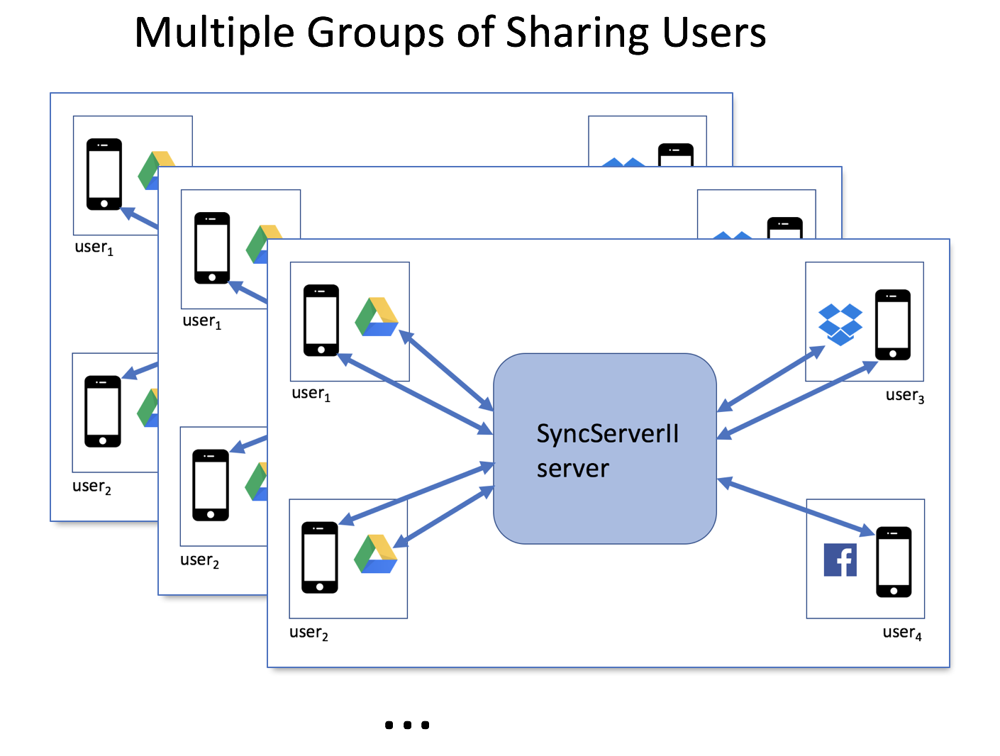

For documentation see: https://crspybits.github.io/SyncServerII/

SyncServerII supports multiple groups of sharing users synchronizing their data across owers' cloud storage:

When building, during development, with Xcode, make sure you select 
"Server > My Mac" otherwise you may get errors like: unable to resolve product type 'com.apple.product-type.tool' for platform 'iphoneos' (in target 'Main')
